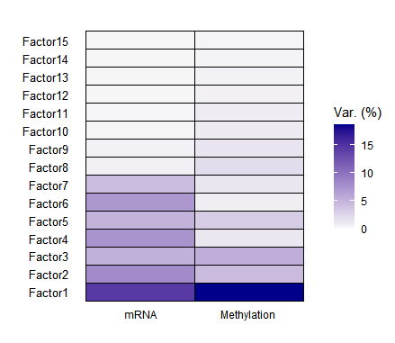

# Multi-Omics Integration in Multiple Sclerosis (MS)

This project performs an integrative analysis of **RNA-seq** and **DNA methylation**
data from paired MS brain **lesion** and **NAWM** samples (N = 18).

We use a set of single-omics and multi-omics methods to identify:

- Differentially expressed genes (DEGs)
- Differentially methylated CpG sites (DMPs)
- Links between methylation and gene expression
- Latent factors (MOFA)
- Supervised multi-omics signatures (DIABLO)
- Patient clusters based on fused networks (SNF)
- Gene/CpG network modules (WGCNA)

---

## Graphical Abstract

> Below is the overall workflow summarizing the full analysis pipeline.

---

## Table of Contents

1. [Project Overview](#project-overview)  
2. [Data](#data)  
3. [mRNA Analysis](#mrna-analysis)  
4. [DNA Methylation Analysis](#dna-methylation-analysis)  
5. [MOFA – Unsupervised Integration](#mofa--unsupervised-integration)  
6. [DIABLO – Supervised Integration](#diablo--supervised-integration)  
7. [SNF – Similarity Network Fusion](#snf--similarity-network-fusion)  
8. [WGCNA – Co-expression/Co-methylation Modules](#wgcna--co-expressionco-methylation-modules)  
9. [How to Run](#how-to-run)  
10. [Team](#team)

---

## Project Overview

This repository integrates **transcriptomic (mRNA)** and **DNA methylation** data
from MS brain **lesion** and **NAWM** samples.

The goal is to:

- understand molecular differences between lesion and NAWM  
- identify epigenetic–transcriptomic signatures  
- discover patient subgroups and biological modules  
- compare different multi-omics integration methods  

---

## Data

- **Samples:** 18 patient-matched lesion / NAWM samples  
- **mRNA:** filtered, normalised expression matrices  
- **DNA methylation:** beta or M-values from Illumina array  
- **Clinical metadata:** stored in `data/clinical/`  

Raw full-size matrices are excluded using `.gitignore`.  
Small subsets used in analysis are stored under the `data/` directory.

## mRNA Analysis

This section describes the differential expression analysis of the **RNA-seq** data
comparing MS brain **lesion** vs **NAWM** samples.

---

### 🔹 1) Quality Control of Expression Values

Before running the differential expression analysis, the RNA-seq counts were 
filtered, normalised, and transformed (log2).  
The histogram below shows the distribution of processed expression values.

The distribution looks typical for RNA-seq data and shows no major artefacts.

---

### 🔹 2) Differential Expression (Lesion vs NAWM)

A differential expression analysis (e.g. DESeq2) identified genes significantly
up- or down-regulated in lesions compared to NAWM.

**Global volcano plot:**

- Each dot = gene  
- X-axis = log2 fold change  
- Y-axis = −log10(p-value)  
- Red/blue points show significantly regulated genes

---

### 🔹 3) Annotated Volcano (Key DEGs)

We highlight biologically relevant DEGs (immune-related, myelin-related, signalling genes).

This plot makes it easier to identify potential biomarkers.

---

### 🔹 4) Heatmap of Significant DEGs

A heatmap of the top differentially expressed genes shows **clear separation**
between lesion and NAWM samples.

Lesion and NAWM samples form distinct clusters, reflecting strong transcriptional differences.

---

### ✔️ Summary (mRNA)

- Lesion samples show strong transcriptional activation relative to NAWM  
- Clear gene-level signatures emerge (DEGs)  
- These genes are later integrated with methylation in MOFA, DIABLO, and SNF

## DNA Methylation Analysis

This section summarises the differential methylation analysis between **MS brain
lesion** and **NAWM** samples. The goal is to identify differentially methylated
CpG sites (DMPs) and link them to changes in gene expression.

---

### 🔹 1) Quality Control of Methylation Values

Raw beta/M-values were inspected to ensure correct distribution before filtering
and normalisation.

The distribution shows the expected bimodal shape typical for Illumina
methylation arrays, indicating good data quality.

---

### 🔹 2) Differentially Methylated Positions (DMPs)

A differential methylation analysis was performed between lesion and NAWM.

**Volcano plot of CpGs:**

- Each point = CpG site  
- X-axis = difference in methylation  
- Y-axis = −log10(p-value)  
- Significant hyper-/hypo-methylated CpGs clearly separate

---

### 🔹 3) Heatmap of Significant CpGs

A heatmap of the top significantly methylated CpGs shows clear structure and
good separation between lesion and NAWM samples.

This pattern indicates strong epigenetic differences between the two tissue types.

---

### 🔹 4) Immune Cell Infiltration (Lesion vs NAWM)

Estimated immune cell proportions (using deconvolution methods) show clear
lesion-associated immune activation.

Lesion samples display increased immune-cell signatures, consistent with
pathology of MS lesions.

---

### 🔹 5) Gene-level Integration Example (PALMD)

For genes such as **PALMD**, methylation at multiple CpG sites changes between
lesion and NAWM, and these changes correlate with gene expression.

This provides a direct epigenetic–transcriptomic link and identifies PALMD as a
potential biomarker.

---

### ✔️ Summary (Methylation)

- Strong methylation changes distinguish lesion from NAWM  
- Several CpGs map to genes showing matched expression changes  
- Immune infiltration signatures are strongly elevated in lesion tissue  
- These findings integrate later with MOFA, DIABLO, and WGCNA
