# Multi-Omics Integration in Multiple Sclerosis (MS)

This repository performs an integrative analysis of **RNA-seq** and **DNA methylation** data from paired multiple-sclerosis (MS) brain **lesion** and **normal-appearing white matter (NAWM)** samples (N = 18).

We use a set of single-omics and multi-omics methods to identify:

- Differentially expressed genes (DEGs)
- Differentially methylated CpG sites (DMPs)
- Links between methylation and gene expression
- Latent factors (MOFA)
- Supervised multi-omics signatures (DIABLO)
- Patient clusters based on fused networks (SNF)
- Gene/CpG network modules (WGCNA)

---

## Graphical Abstract

> Overall workflow summarising the full analysis pipeline.

<p align="center">
  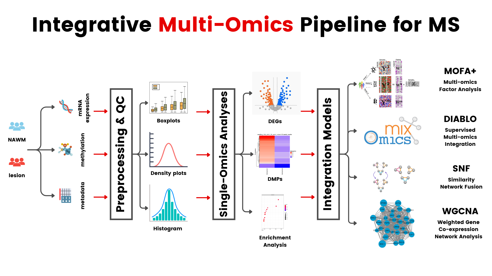
</p>

---

## Table of Contents

1. [Project Overview](#project-overview)  
2. [Data](#data)  
3. [mRNA Analysis](#mrna-analysis)  
4. [DNA Methylation Analysis](#dna-methylation-analysis)  
5. [MOFA – Unsupervised Multi-Omics Integration](#mofa--unsupervised-multi-omics-integration)  
6. [DIABLO – Supervised Multi-Omics Integration](#diablo--supervised-multi-omics-integration)  
7. [SNF – Similarity Network Fusion](#snf--similarity-network-fusion)  
8. [WGCNA – Network Modules](#wgcna--network-modules)  
9. [How to Run](#how-to-run)  
10. [Team](#team)

---

## Project Overview

This repository integrates **transcriptomic (mRNA)** and **DNA methylation** data from MS brain **lesion** and **NAWM** samples.

The goal is to:

- understand molecular differences between lesion and NAWM  
- identify epigenetic–transcriptomic signatures  
- discover patient subgroups and biological modules  
- compare different multi-omics integration methods  

---

## Data

- **Samples:** 18 patient-matched lesion / NAWM samples  
- **mRNA:** filtered, normalised expression matrices  
- **DNA methylation:** beta or M-values from Illumina array  
- **Clinical metadata:** stored in `data/clinical/`  

Raw full-size matrices are excluded using `.gitignore`.  
Light-weight subsets used in the analysis are stored under the `data/` directory.

---

## mRNA Analysis

This section describes the differential expression analysis of the **RNA-seq** data comparing MS brain **lesion** vs **NAWM** samples.

### 1) Quality Control of Expression Values

Before running the differential expression analysis, the RNA-seq counts were filtered, normalised, and log2-transformed.  
The histogram below shows the distribution of processed expression values.

<p align="center">
  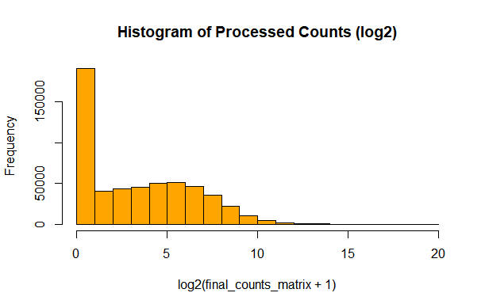
</p>

The distribution looks typical for RNA-seq data and shows no major artefacts.

---

### 2) Differential Expression (Lesion vs NAWM)

A differential expression analysis (e.g. **DESeq2**) identified genes significantly up- or down-regulated in lesions compared to NAWM.

**Global volcano plot:**

<p align="center">
  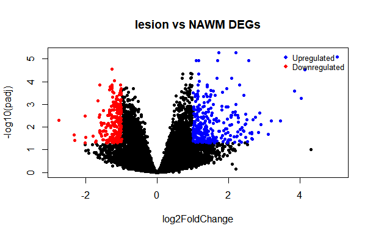
</p>

- Each dot = gene  
- X-axis = log2 fold change  
- Y-axis = −log10(p-value)  
- Red/blue points show significantly regulated genes  

---

### 3) Annotated Volcano (Key DEGs)

We highlight biologically relevant DEGs (immune-related, myelin-related, signalling genes).

<p align="center">
  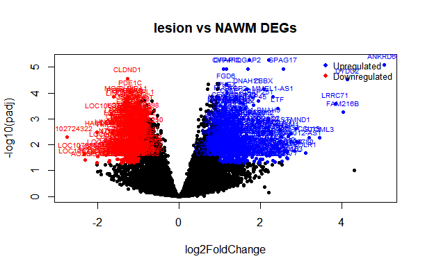
</p>

This plot makes it easier to identify potential biomarkers.

---

### 4) Heatmap of Significant DEGs

A heatmap of the top differentially expressed genes shows **clear separation** between lesion and NAWM samples.

<p align="center">
  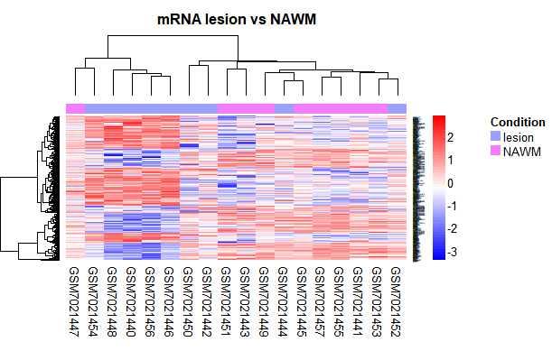
</p>

Lesion and NAWM samples form distinct clusters, reflecting strong transcriptional differences.

---

### ✔️ Summary (mRNA)

- Lesion samples show strong transcriptional activation relative to NAWM  
- Clear gene-level signatures (DEGs) emerge  
- These genes are later integrated with methylation in MOFA, DIABLO, and SNF  

---

## DNA Methylation Analysis

This section summarises the DNA methylation differences between **MS lesion** and **NAWM** brain tissue.  
We identify differentially methylated CpG sites (DMPs), visualise their patterns, and explore immune-cell involvement.

### 1) Quality Control of Methylation Values

Beta- and M-values were inspected to ensure correct distribution before filtering and normalisation.

<p align="center">
  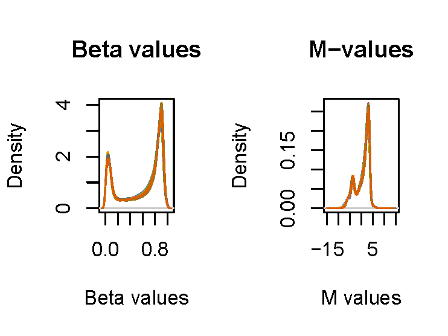
</p>

The bimodal distribution is typical for Illumina methylation arrays and indicates good data quality.

---

### 2) Immune Cell Infiltration (CIBERSORT)

Epigenetically inferred immune-cell proportions show higher immune activation in lesion samples.

<p align="center">
  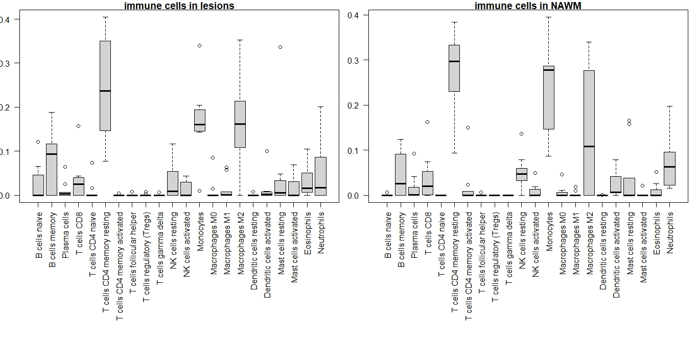
</p>

Lesions exhibit elevated T cells, macrophage activity, and innate immune signals—consistent with MS pathology.

---

### 3) Example Gene: PALMD (CpG + Expression)

PALMD shows multiple CpGs significantly altered between lesion and NAWM.  
These methylation changes correlate with its gene expression level.

<p align="center">
  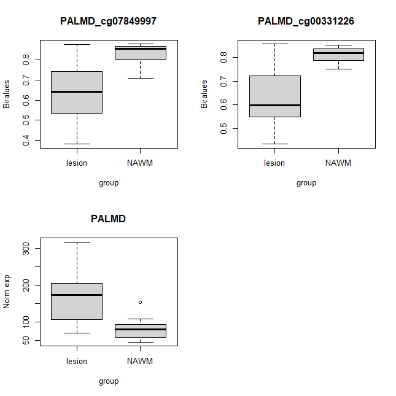
</p>

This highlights a direct epigenetic–transcriptomic link relevant to MS lesion biology.

---

### ✔️ Summary (Methylation)

- Strong methylation signatures separate lesion vs NAWM  
- Many CpGs map to genes relevant to MS (e.g. **PALMD**)  
- Immune infiltration strongly increases in lesions  
- Results integrate later with MOFA, DIABLO, and WGCNA  

---

## MOFA – Unsupervised Multi-Omics Integration

MOFA (Multi-Omics Factor Analysis) was used to learn shared latent factors that capture coordinated variation between **mRNA expression** and **DNA methylation**.  
These factors summarise the major biological drivers separating **lesion** and **NAWM** samples.

### 1) Variance Explained per View

MOFA learns latent factors (F1, F2, …) and estimates how much variation each factor explains in each omic (mRNA vs methylation).

<p align="center">
  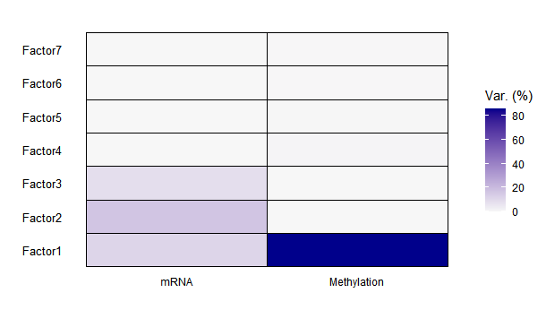
</p>

- **Factor 1** explains the largest proportion of methylation variance  
- **Factors 2/3** capture shared variation across both omics  
- Higher factors explain smaller residual structure  

This indicates strong coordinated structure between the two omics layers.

---

### 2) Factor Space (Lesion vs NAWM)

Plotting samples along the learned factors shows clear biological separation.

<p align="center">
  
</p>

- Lesion and NAWM samples cluster apart in the MOFA factor space  
- Indicates that the latent factors capture meaningful disease-related variation  

---

### 3) Top Features Driving the Factors

MOFA provides feature loadings showing which genes/CpGs contribute most to each factor.

**Top mRNA features (Factor 1):**

<p align="center">
  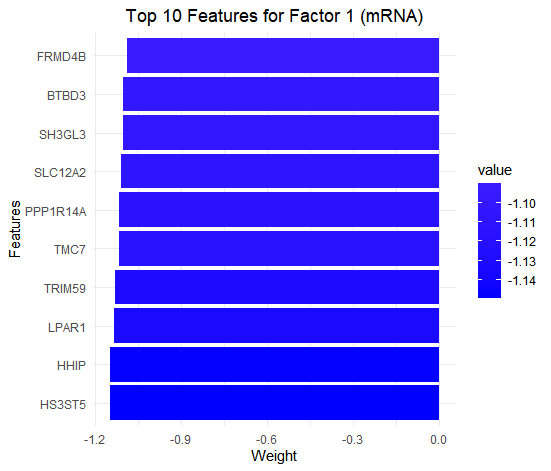
</p>

**Top CpG features (Factor 6):**

<p align="center">
  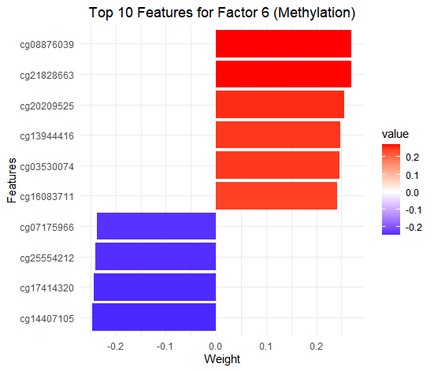
</p>

These genes and CpGs form the core multi-omics signatures differentiating lesion vs NAWM.

---

### 4) Associations with Clinical Metadata

MOFA factors were tested against metadata such as tissue type, age, and gender.

<p align="center">
  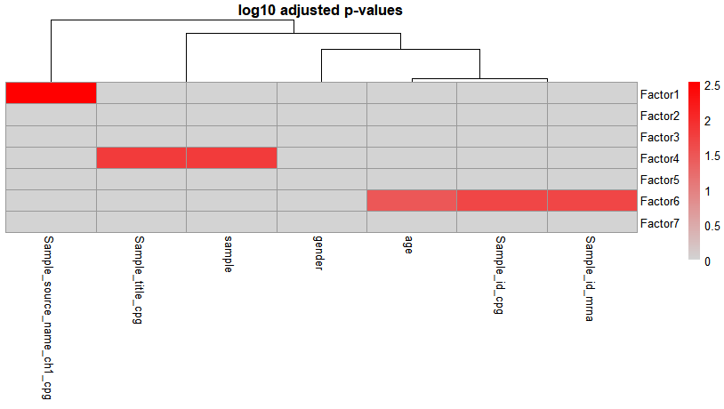
</p>

- Factors associated with **lesion/NAWM** represent biologically meaningful signals  
- Other factors capture patient-level heterogeneity  

---

### ✔️ Summary (MOFA)

- Learned latent factors capture shared variation across RNA + methylation  
- Factor 1 strongly separates lesion from NAWM  
- Multi-omics signatures involve immune-related genes and CpGs with coordinated changes  
- Metadata associations support biological interpretation  

---

## DIABLO – Supervised Multi-Omics Integration

DIABLO (from the **mixOmics** framework) is a supervised multi-omics integration method.  
It learns components that jointly select **mRNA genes** and **CpG sites** that best discriminate **lesion** from **NAWM** samples.

This method directly links RNA expression and DNA methylation to produce a multi-omics molecular signature.

<p align="center">
  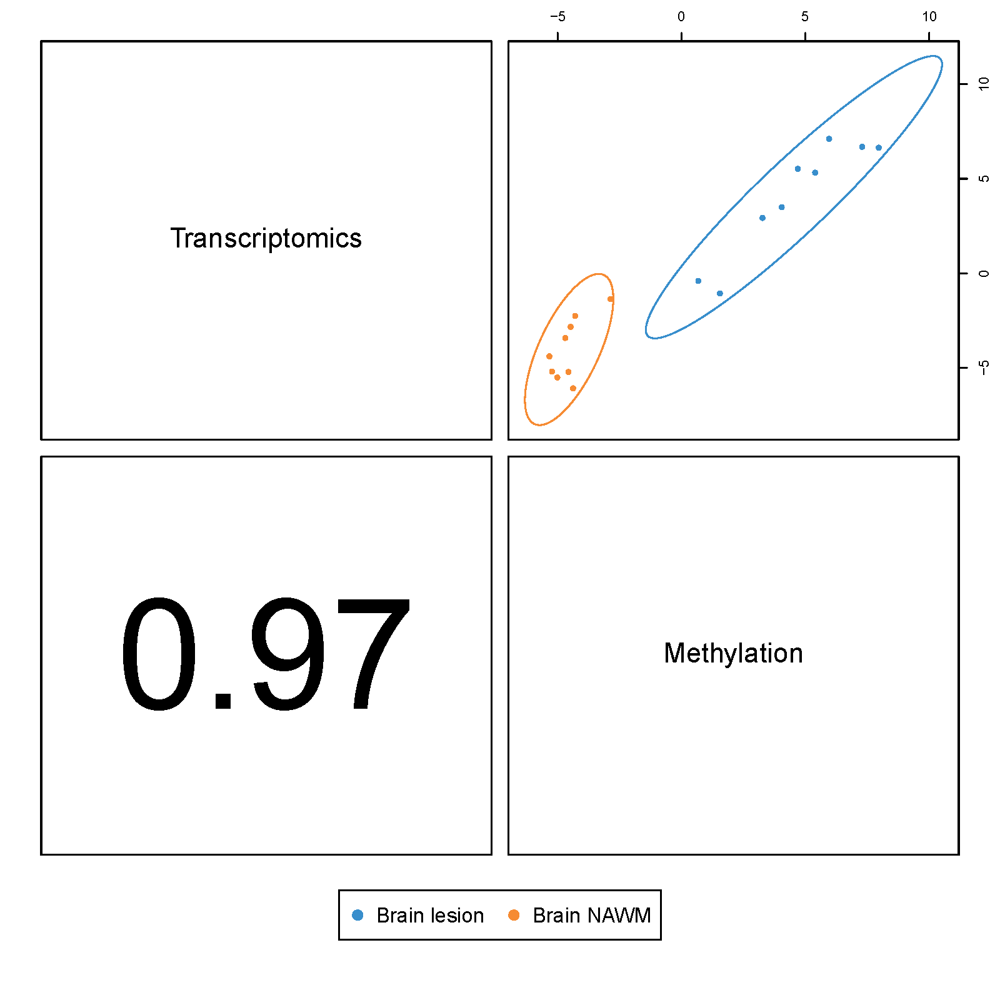
</p>

---

### 1) Sample Separation (plotIndiv)

DIABLO clearly separates lesion vs NAWM samples in the first discriminative components.

<p align="center">
  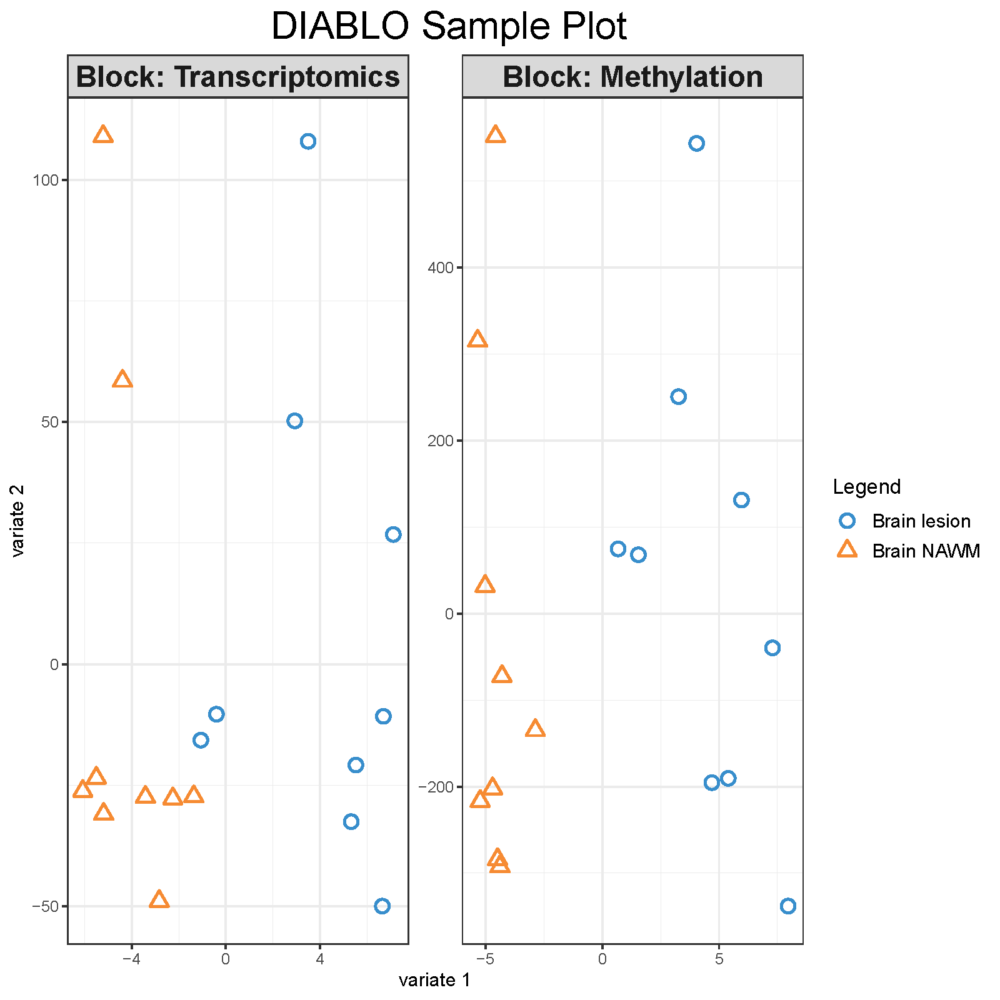
</p>

This shows that the supervised model successfully captures disease-related variation.

---

### 2) Multi-Omics Correlation Network (Circos Plot)

DIABLO identifies correlated sets of CpGs and genes that jointly contribute to lesion/NAWM discrimination.

<p align="center">
  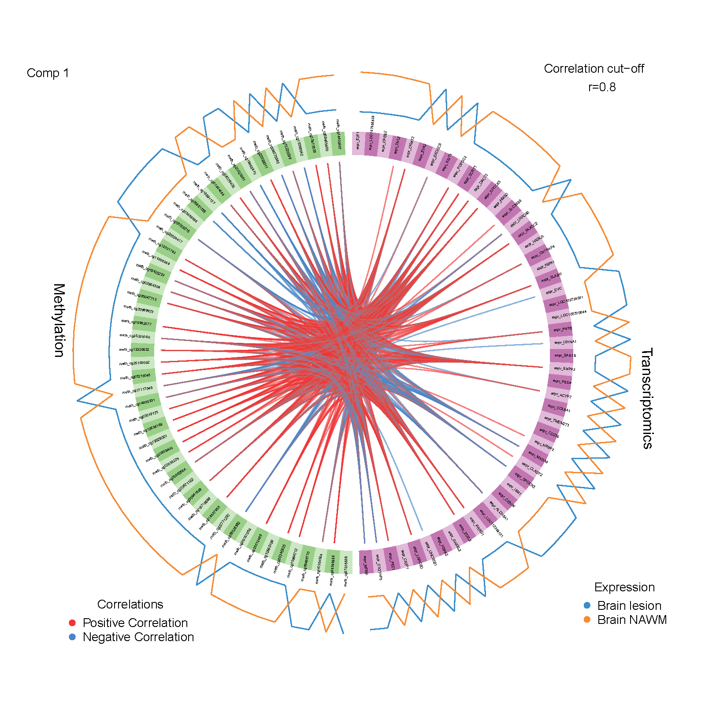
</p>

The circos plot displays cross-omics correlations (gene ↔ CpG), revealing coordinated regulatory patterns.

---

### 3) Top Features Selected by DIABLO (Loadings)

DIABLO provides loadings showing which genes and CpGs contribute most strongly to the discriminative component.

<p align="center">
  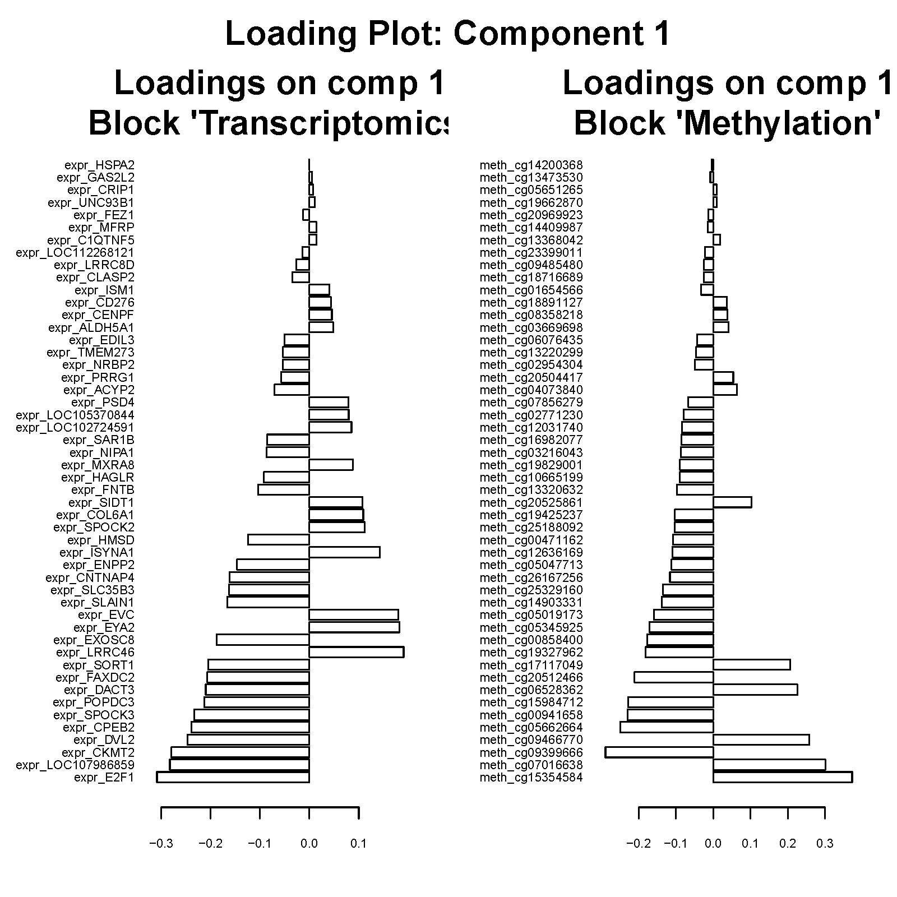
</p>

<p align="center">
  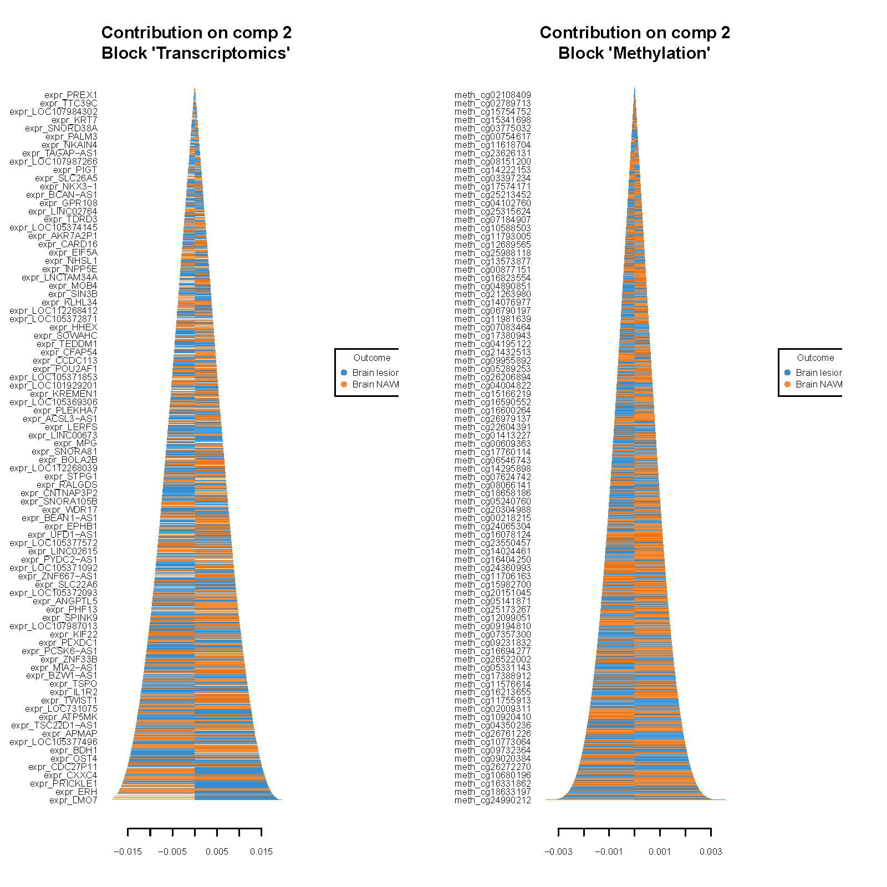
</p>

These features form a compact and interpretable multi-omics biomarker signature.

---

### 4) Explained Variance

DIABLO components explain a meaningful proportion of variance across the two omics layers.

<p align="center">
  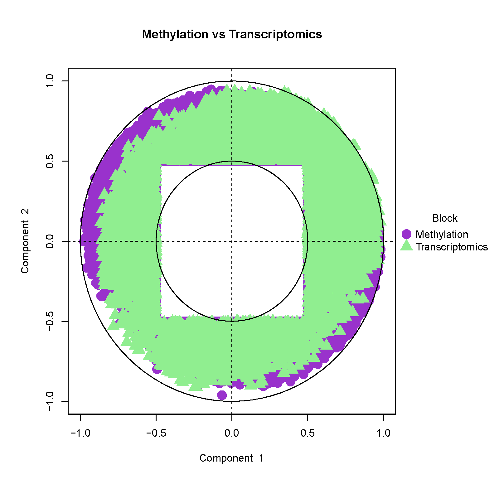
</p>

This confirms that the discriminative signal is shared between the mRNA and methylation datasets.

---

### ✔️ Summary (DIABLO)

- Strong supervised separation between lesion vs NAWM  
- Identifies correlated gene–CpG signatures  
- Highlights biologically interpretable features  
- Complements MOFA (unsupervised) and SNF (network-based)  

---

## SNF – Similarity Network Fusion

SNF (Similarity Network Fusion) builds a **joint similarity network** by combining the mRNA and methylation similarity graphs.  
This fused network reveals patient-level structure that cannot be seen from any single omic alone.

---

### 1) Fused Similarity Matrix

The fused similarity matrix shows three stable patient clusters based on combined RNA + DNA methylation information.

<p align="center">
  
</p>

- Darker colours = stronger similarity  
- SNF clusters reflect shared biological patterns across omics  

---

### 2) t-SNE Projection of Fused Network

A t-SNE embedding of the fused network shows clear grouping of samples.

<p align="center">
  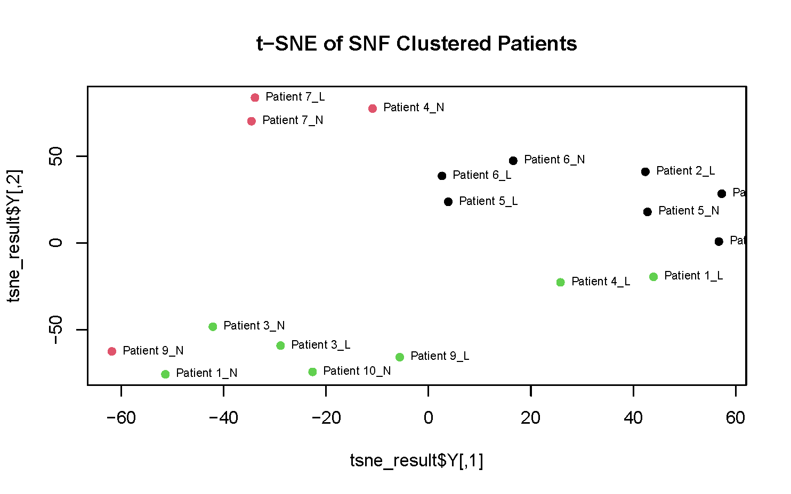
</p>

This confirms the stability of SNF clusters in a nonlinear low-dimensional space.

---

### 3) PCA of the Fused Similarity

Principal Component Analysis on the fused similarity matrix shows additional separation of the patient groups.

<p align="center">
  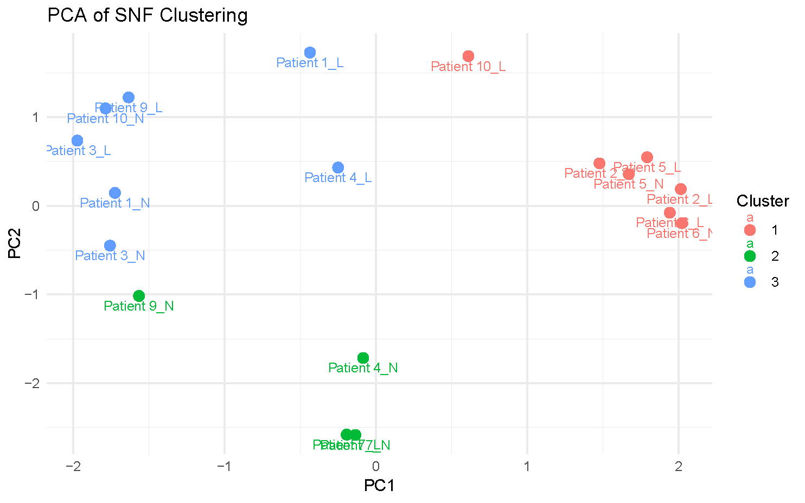
</p>

---

### 4) Hierarchical Clustering

Hierarchical clustering of the fused similarity network provides a consistent cluster structure.

<p align="center">
  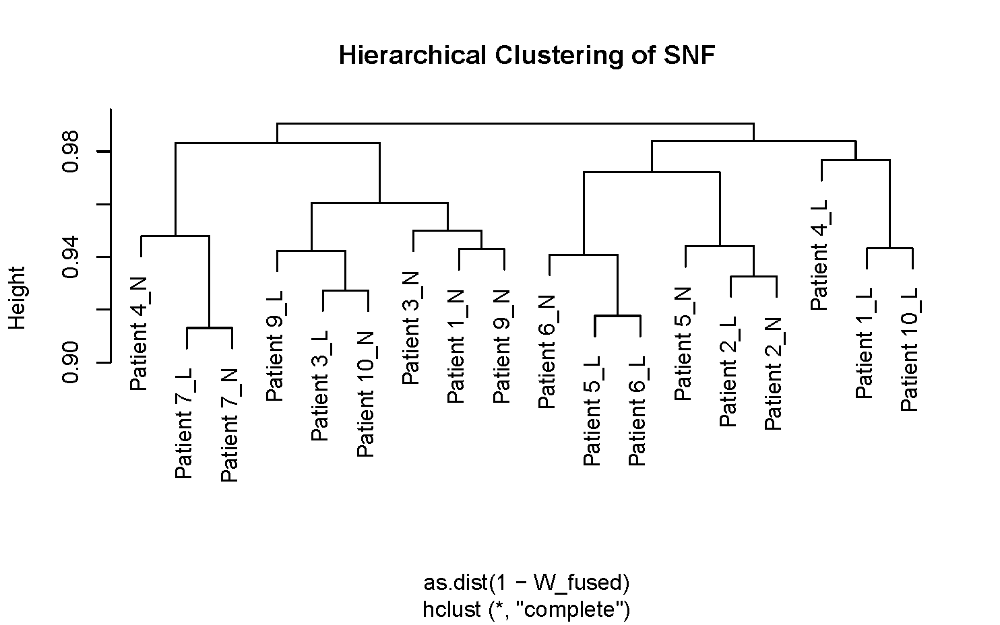
</p>

---

### ✔️ Summary (SNF)

- SNF integrates methylation + mRNA similarities into a single patient graph  
- Identifies consistent patient subgroups  
- Provides complementary information to MOFA and DIABLO  
- Captures sample-level heterogeneity beyond single-omic analyses  

---

## WGCNA – Network Modules

WGCNA (Weighted Gene Co-expression Network Analysis) was used to identify **co-expression** (and optionally co-methylation) **modules** that group genes/CpGs with similar behaviour across samples.

This helps reveal coordinated biological programmes underlying lesion vs NAWM differences.

---

### 1) Sample Clustering (Outlier Detection)

Before building the network, samples were clustered to check for potential outliers.

<p align="center">
  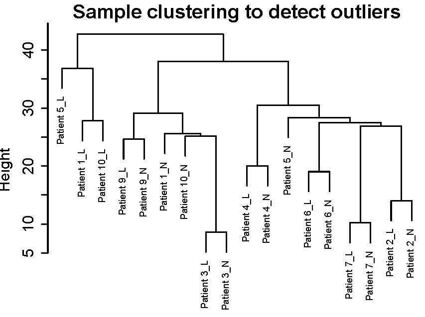
</p>

No strong outliers were detected; therefore, all samples were retained.

---

### 2) Soft-Threshold Power Selection

The soft-threshold (β) was chosen to achieve approximate scale-free topology.

<p align="center">
  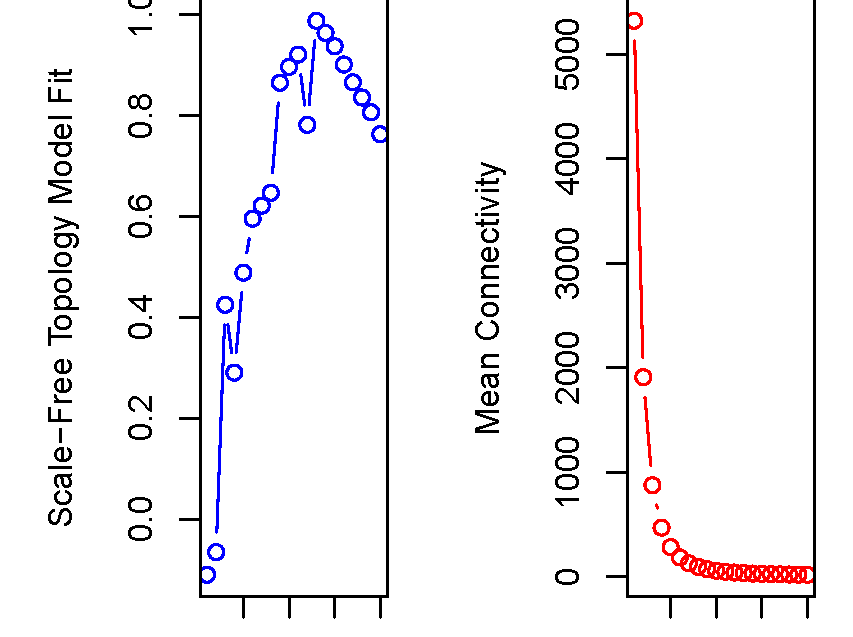
</p>

- The chosen β gives a high scale-free fit  
- Ensures biologically meaningful network structure  

---

### 3) Gene Co-expression Modules

Using the TOM (Topological Overlap Matrix) and dynamic tree cut, WGCNA identified multiple gene modules (each represented by a colour).

<p align="center">
  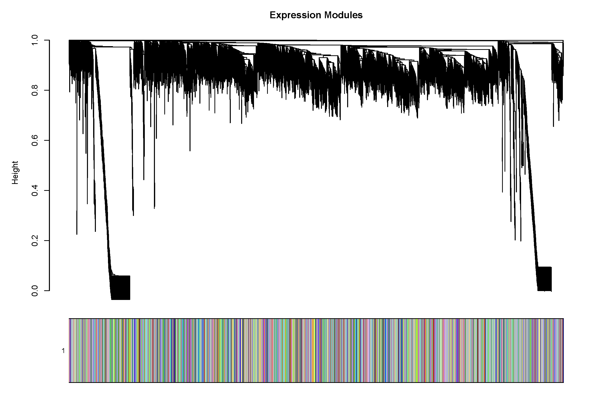
</p>

These modules represent groups of genes with coordinated expression patterns that may be linked to lesion/NAWM biology.

---

### ✔️ Summary (WGCNA)

- No outliers detected → all samples used  
- Scale-free topology achieved at the chosen β  
- Multiple gene modules discovered  
- Modules serve as features for downstream interpretation and integration  

---

## How to Run

All analyses in this project were performed using **R**.

### 1) Install required packages

```r
install.packages(c("tidyverse", "data.table", "ggplot2", "pheatmap"))

if (!requireNamespace("BiocManager", quietly = TRUE)) {
  install.packages("BiocManager")
}

BiocManager::install(c(
  "DESeq2", "limma", "WGCNA", "MOFA2", "mixOmics"
))

install.packages("SNFtool")
````

---

### 2) Directory structure

The repository expects the following folder structure:

```text
data/
  rna/          # Light-weight processed RNA data (DEGs, subsets)
  methylation/  # Light-weight CpG subsets
  clinical/     # Clinical metadata

data-raw/       # Raw matrices (NOT uploaded to GitHub)
scripts/        # R scripts for each analysis step

mRNA/           # mRNA analysis plots
methylation/    # DNA methylation plots
MOFA/           # MOFA results
DIABLO/         # DIABLO results
SNF/            # SNF results
WGCNA/          # WGCNA results
```

---

### 3) Execute the full analysis pipeline

From the project root:

```r
source("scripts/01_mRNA_DEG_analysis.R")
source("scripts/02_methylation_preprocess.R")
source("scripts/03_SNF_pipeline.R")
source("scripts/04_MOFA_pipeline.R")
source("scripts/05_DIABLO_pipeline.R")
source("scripts/06_WGCNA_pipeline.R")
```

Each script automatically outputs:

* Figures → into the appropriate results folder
* Processed tables → into `data/`
* Model objects → into their analysis folder

---

### 4) Reproducibility

* All scripts are fully reproducible as long as **folder paths** remain unchanged
* Large raw data remain excluded using `.gitignore`
* Light-weight subsets are included so that example analyses run without issues

---

## Team

This project was developed as part of the **BEAM – SOLE Multi-Omics Challenge**.

**Contributors:**

* **Salma** – Data preprocessing & methylation analysis
* **Abdulaziz** – RNA-seq analysis & DIABLO analysis
* **Heba** – Visualisation & interpretation
* **Mai** – MOFA analysis
* **Merna** – SNF & network analysis
* **Abdulaziz** – Project integration, pipeline design, documentation


